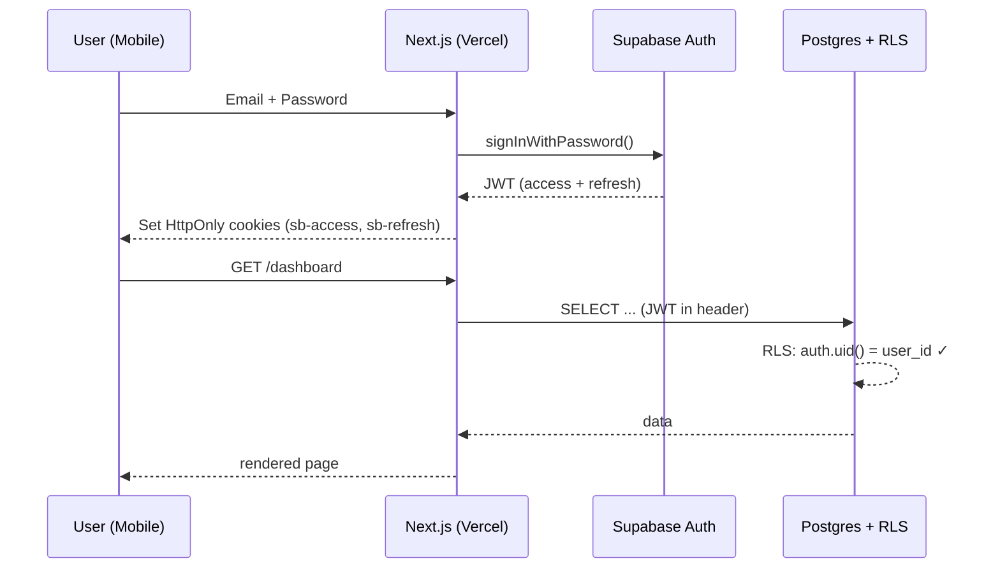

# 🏗️ Technical Blueprint: Fruit Sales Tracker

> Version 1.0 | 2026-05-16 | อ้างอิงจาก [PRD.md](./PRD.md)

---

## 1. ER Diagram

```mermaid
erDiagram
    auth_users ||--|| profiles : "1:1"
    profiles ||--o{ products : "owns"
    profiles ||--o{ daily_entries : "creates"
    daily_entries ||--o{ sale_items : "contains"
    daily_entries ||--o{ extra_incomes : "contains"
    daily_entries ||--o{ purchase_items : "contains"
    daily_entries ||--o{ extra_expenses : "contains"

    auth_users {
        uuid id PK
        text email
        text encrypted_password
    }

    profiles {
        uuid id PK_FK
        text display_name
        timestamptz created_at
    }

    products {
        uuid id PK
        uuid user_id FK
        text name
        timestamptz last_used_at
        timestamptz created_at
    }

    daily_entries {
        uuid id PK
        uuid user_id FK
        date entry_date
        timestamptz created_at
        timestamptz updated_at
        timestamptz deleted_at
    }

    sale_items {
        uuid id PK
        uuid entry_id FK
        text product_name
        numeric quantity_kg
        numeric price_per_kg
        numeric total
        int sort_order
    }

    extra_incomes {
        uuid id PK
        uuid entry_id FK
        text description
        numeric amount
        int sort_order
    }

    purchase_items {
        uuid id PK
        uuid entry_id FK
        text product_name
        numeric quantity_kg
        numeric price_per_kg
        numeric total
        int sort_order
    }

    extra_expenses {
        uuid id PK
        uuid entry_id FK
        text description
        numeric amount
        int sort_order
    }
```

### Cardinality Summary

| Relationship | Type | Note |
|---|---|---|
| auth.users → profiles | 1:1 | Supabase Auth trigger สร้าง profile อัตโนมัติ |
| profiles → products | 1:N | สินค้า master list ต่อ user |
| profiles → daily_entries | 1:N | UNIQUE(user_id, entry_date) — 1 entry ต่อวัน |
| daily_entries → sale_items / extra_incomes / purchase_items / extra_expenses | 1:N | CASCADE DELETE |

---

## 2. Database Schema Definition

### 2.1 SQL Migration (รันบน Supabase SQL Editor)

```sql
-- ============================================
-- 1. PROFILES (เชื่อม auth.users 1:1)
-- ============================================
CREATE TABLE profiles (
    id          uuid PRIMARY KEY REFERENCES auth.users(id) ON DELETE CASCADE,
    display_name text,
    created_at  timestamptz NOT NULL DEFAULT now()
);

-- Auto-create profile หลังสมัคร
CREATE OR REPLACE FUNCTION public.handle_new_user()
RETURNS trigger
LANGUAGE plpgsql SECURITY DEFINER
AS $$
BEGIN
    INSERT INTO public.profiles (id, display_name)
    VALUES (new.id, COALESCE(new.raw_user_meta_data->>'display_name', split_part(new.email, '@', 1)));
    RETURN new;
END;
$$;

CREATE TRIGGER on_auth_user_created
    AFTER INSERT ON auth.users
    FOR EACH ROW EXECUTE FUNCTION public.handle_new_user();

-- ============================================
-- 2. PRODUCTS (master list สำหรับ combobox)
-- ============================================
CREATE TABLE products (
    id            uuid PRIMARY KEY DEFAULT gen_random_uuid(),
    user_id       uuid NOT NULL REFERENCES profiles(id) ON DELETE CASCADE,
    name          text NOT NULL,
    last_used_at  timestamptz NOT NULL DEFAULT now(),
    created_at    timestamptz NOT NULL DEFAULT now(),
    UNIQUE(user_id, name)
);
CREATE INDEX idx_products_user_recent ON products(user_id, last_used_at DESC);

-- ============================================
-- 3. DAILY_ENTRIES (หัวรายการประจำวัน)
-- ============================================
CREATE TABLE daily_entries (
    id          uuid PRIMARY KEY DEFAULT gen_random_uuid(),
    user_id     uuid NOT NULL REFERENCES profiles(id) ON DELETE CASCADE,
    entry_date  date NOT NULL,
    created_at  timestamptz NOT NULL DEFAULT now(),
    updated_at  timestamptz NOT NULL DEFAULT now(),
    deleted_at  timestamptz,
    UNIQUE(user_id, entry_date)
);
CREATE INDEX idx_entries_user_date ON daily_entries(user_id, entry_date DESC)
    WHERE deleted_at IS NULL;

-- Trigger update updated_at
CREATE OR REPLACE FUNCTION trg_set_updated_at() RETURNS trigger
LANGUAGE plpgsql AS $$
BEGIN
    NEW.updated_at = now();
    RETURN NEW;
END;
$$;
CREATE TRIGGER set_updated_at BEFORE UPDATE ON daily_entries
    FOR EACH ROW EXECUTE FUNCTION trg_set_updated_at();

-- ============================================
-- 4. SALE_ITEMS
-- ============================================
CREATE TABLE sale_items (
    id            uuid PRIMARY KEY DEFAULT gen_random_uuid(),
    entry_id      uuid NOT NULL REFERENCES daily_entries(id) ON DELETE CASCADE,
    product_name  text NOT NULL,
    quantity_kg   numeric(10,2) NOT NULL CHECK (quantity_kg > 0),
    price_per_kg  numeric(10,2) NOT NULL CHECK (price_per_kg >= 0),
    total         numeric(12,2) GENERATED ALWAYS AS (quantity_kg * price_per_kg) STORED,
    sort_order    int NOT NULL DEFAULT 0
);
CREATE INDEX idx_sale_items_entry ON sale_items(entry_id);

-- ============================================
-- 5. EXTRA_INCOMES
-- ============================================
CREATE TABLE extra_incomes (
    id           uuid PRIMARY KEY DEFAULT gen_random_uuid(),
    entry_id     uuid NOT NULL REFERENCES daily_entries(id) ON DELETE CASCADE,
    description  text NOT NULL,
    amount       numeric(12,2) NOT NULL CHECK (amount >= 0),
    sort_order   int NOT NULL DEFAULT 0
);
CREATE INDEX idx_extra_incomes_entry ON extra_incomes(entry_id);

-- ============================================
-- 6. PURCHASE_ITEMS
-- ============================================
CREATE TABLE purchase_items (
    id            uuid PRIMARY KEY DEFAULT gen_random_uuid(),
    entry_id      uuid NOT NULL REFERENCES daily_entries(id) ON DELETE CASCADE,
    product_name  text NOT NULL,
    quantity_kg   numeric(10,2) NOT NULL CHECK (quantity_kg > 0),
    price_per_kg  numeric(10,2) NOT NULL CHECK (price_per_kg >= 0),
    total         numeric(12,2) GENERATED ALWAYS AS (quantity_kg * price_per_kg) STORED,
    sort_order    int NOT NULL DEFAULT 0
);
CREATE INDEX idx_purchase_items_entry ON purchase_items(entry_id);

-- ============================================
-- 7. EXTRA_EXPENSES
-- ============================================
CREATE TABLE extra_expenses (
    id           uuid PRIMARY KEY DEFAULT gen_random_uuid(),
    entry_id     uuid NOT NULL REFERENCES daily_entries(id) ON DELETE CASCADE,
    description  text NOT NULL,
    amount       numeric(12,2) NOT NULL CHECK (amount >= 0),
    sort_order   int NOT NULL DEFAULT 0
);
CREATE INDEX idx_extra_expenses_entry ON extra_expenses(entry_id);
```

### 2.2 Row Level Security (RLS) Policies

```sql
-- เปิด RLS ทุก table
ALTER TABLE profiles        ENABLE ROW LEVEL SECURITY;
ALTER TABLE products        ENABLE ROW LEVEL SECURITY;
ALTER TABLE daily_entries   ENABLE ROW LEVEL SECURITY;
ALTER TABLE sale_items      ENABLE ROW LEVEL SECURITY;
ALTER TABLE extra_incomes   ENABLE ROW LEVEL SECURITY;
ALTER TABLE purchase_items  ENABLE ROW LEVEL SECURITY;
ALTER TABLE extra_expenses  ENABLE ROW LEVEL SECURITY;

-- profiles: ดู/แก้ profile ตัวเอง
CREATE POLICY profiles_self ON profiles
    FOR ALL USING (auth.uid() = id) WITH CHECK (auth.uid() = id);

-- products: เจ้าของเท่านั้น
CREATE POLICY products_owner ON products
    FOR ALL USING (auth.uid() = user_id) WITH CHECK (auth.uid() = user_id);

-- daily_entries: เจ้าของเท่านั้น
CREATE POLICY entries_owner ON daily_entries
    FOR ALL USING (auth.uid() = user_id) WITH CHECK (auth.uid() = user_id);

-- child tables: เข้าได้ถ้า parent entry เป็นของตัวเอง
CREATE POLICY sale_items_owner ON sale_items
    FOR ALL USING (EXISTS (
        SELECT 1 FROM daily_entries e
        WHERE e.id = sale_items.entry_id AND e.user_id = auth.uid()
    ));

CREATE POLICY extra_incomes_owner ON extra_incomes
    FOR ALL USING (EXISTS (
        SELECT 1 FROM daily_entries e
        WHERE e.id = extra_incomes.entry_id AND e.user_id = auth.uid()
    ));

CREATE POLICY purchase_items_owner ON purchase_items
    FOR ALL USING (EXISTS (
        SELECT 1 FROM daily_entries e
        WHERE e.id = purchase_items.entry_id AND e.user_id = auth.uid()
    ));

CREATE POLICY extra_expenses_owner ON extra_expenses
    FOR ALL USING (EXISTS (
        SELECT 1 FROM daily_entries e
        WHERE e.id = extra_expenses.entry_id AND e.user_id = auth.uid()
    ));
```

### 2.3 Dashboard Aggregation View

```sql
-- View สำหรับ Dashboard (ใช้กับ filter ช่วงวันที่)
CREATE OR REPLACE VIEW daily_summary AS
SELECT
    e.id            AS entry_id,
    e.user_id,
    e.entry_date,
    COALESCE((SELECT SUM(total)  FROM sale_items     WHERE entry_id = e.id), 0)
        + COALESCE((SELECT SUM(amount) FROM extra_incomes  WHERE entry_id = e.id), 0)
        AS total_income,
    COALESCE((SELECT SUM(total)  FROM purchase_items WHERE entry_id = e.id), 0)
        + COALESCE((SELECT SUM(amount) FROM extra_expenses WHERE entry_id = e.id), 0)
        AS total_expense,
    COALESCE((SELECT SUM(quantity_kg) FROM sale_items WHERE entry_id = e.id), 0)
        AS total_kg_sold
FROM daily_entries e
WHERE e.deleted_at IS NULL;

-- RPC: top products in date range
CREATE OR REPLACE FUNCTION top_products(
    p_from date, p_to date, p_limit int DEFAULT 5
) RETURNS TABLE (product_name text, total_amount numeric, total_kg numeric)
LANGUAGE sql STABLE SECURITY INVOKER AS $$
    SELECT s.product_name,
           SUM(s.total)       AS total_amount,
           SUM(s.quantity_kg) AS total_kg
    FROM sale_items s
    JOIN daily_entries e ON e.id = s.entry_id
    WHERE e.user_id = auth.uid()
      AND e.deleted_at IS NULL
      AND e.entry_date BETWEEN p_from AND p_to
    GROUP BY s.product_name
    ORDER BY total_amount DESC
    LIMIT p_limit;
$$;
```

---

## 3. API Contracts

> **Architecture Note:** ใช้ Supabase Client SDK โดยตรงจาก Next.js (ผ่าน RLS) สำหรับ CRUD ทั่วไป + Next.js API Routes (Route Handlers) สำหรับ logic ที่ซับซ้อน (atomic save, export)

### 3.1 Authentication

| # | Method | Endpoint / SDK | Payload | Response |
|---|---|---|---|---|
| A1 | POST | `supabase.auth.signUp()` | `{ email, password, options: { data: { display_name } } }` | `{ user, session }` |
| A2 | POST | `supabase.auth.signInWithPassword()` | `{ email, password }` | `{ user, session }` |
| A3 | POST | `supabase.auth.signOut()` | — | `{ error }` |
| A4 | POST | `supabase.auth.resetPasswordForEmail()` | `{ email }` | `{ error }` |

### 3.2 Products (Combobox source)

| # | Method | Endpoint | Description |
|---|---|---|---|
| P1 | GET | `from('products').select().order('last_used_at', desc).limit(50)` | List recent products |
| P2 | POST | `from('products').upsert({ user_id, name, last_used_at: now() }, { onConflict: 'user_id,name' })` | สร้างใหม่/อัปเดต last_used_at |

### 3.3 Daily Entries (CRUD)

#### E1. GET Entry by Date

```http
GET /api/entries?date=2026-05-16
Authorization: Bearer <jwt>
```

**Response 200:**

```json
{
  "entry": {
    "id": "uuid",
    "entry_date": "2026-05-16",
    "sale_items":     [{ "id":"...", "product_name":"ส้ม", "quantity_kg":10.5, "price_per_kg":40, "total":420, "sort_order":0 }],
    "extra_incomes":  [{ "id":"...", "description":"ค่าจ้างขนของ", "amount":300, "sort_order":0 }],
    "purchase_items": [],
    "extra_expenses": [],
    "summary": { "total_income": 720, "total_expense": 0, "net_profit": 720 }
  }
}
```

#### E2. POST/PUT Entry (Atomic Save)

```http
POST /api/entries
Content-Type: application/json
```

**Request:**

```json
{
  "entry_date": "2026-05-16",
  "sale_items":     [{ "product_name":"ส้ม", "quantity_kg":10.5, "price_per_kg":40, "sort_order":0 }],
  "extra_incomes":  [{ "description":"ค่าจ้าง", "amount":300, "sort_order":0 }],
  "purchase_items": [],
  "extra_expenses": []
}
```

**Response 200:** `{ "entry_id": "uuid", "summary": { ... } }`

**Implementation:** ใช้ PostgreSQL function `upsert_daily_entry()` แบบ atomic (transaction) — ลบ child rows เก่าทั้งหมดของ entry_id แล้ว insert ใหม่ทั้งหมด เพื่อความสอดคล้อง

#### E3. DELETE Entry (Soft delete)

```http
DELETE /api/entries/:id
```

**Behavior:** `UPDATE daily_entries SET deleted_at = now() WHERE id = :id`

### 3.4 Dashboard

#### D1. Summary Cards

```http
GET /api/dashboard/summary?from=2026-05-01&to=2026-05-16
```

**Response:**

```json
{
  "total_income": 25400,
  "total_expense": 12300,
  "net_profit": 13100,
  "total_kg_sold": 540.5
}
```

#### D2. Daily Series (สำหรับกราฟแท่ง/เส้น)

```http
GET /api/dashboard/series?from=2026-05-01&to=2026-05-16
```

**Response:**

```json
{
  "series": [
    { "date":"2026-05-01", "income":2000, "expense":800, "profit":1200 },
    { "date":"2026-05-02", "income":1800, "expense":600, "profit":1200 }
  ]
}
```

#### D3. Top Products

```http
GET /api/dashboard/top-products?from=2026-05-01&to=2026-05-16&limit=5
```

**Response:** `[ { "product_name":"ส้ม", "total_amount":8400, "total_kg":210 }, ... ]`

#### D4. Expense Breakdown (Pie)

```http
GET /api/dashboard/expense-breakdown?from=...&to=...
```

**Response:** `{ "purchase": 9000, "other": 3300 }`

### 3.5 Export

```http
GET /api/export?from=...&to=...&format=csv|xlsx
```

**Response:** `Content-Type: text/csv` หรือ `application/vnd.openxmlformats-officedocument.spreadsheetml.sheet` พร้อม `Content-Disposition: attachment`

### 3.6 Error Response Standard

```json
{ "error": { "code": "VALIDATION_ERROR", "message": "quantity_kg must be > 0", "field": "sale_items[0].quantity_kg" } }
```

| HTTP | Code | สถานการณ์ |
|---|---|---|
| 400 | VALIDATION_ERROR | ข้อมูลไม่ถูก format |
| 401 | UNAUTHORIZED | ไม่มี/หมดอายุ JWT |
| 403 | FORBIDDEN | RLS block (เข้าถึงข้อมูลคนอื่น) |
| 404 | NOT_FOUND | entry_id ไม่พบ |
| 409 | CONFLICT | duplicate entry_date |
| 500 | INTERNAL_ERROR | server / DB error |

---

## 4. Security & Authentication Setup

### 4.1 Authentication Flow



### 4.2 Security Layers

| Layer | กลไก |
|---|---|
| Transport | HTTPS only (Vercel + Supabase default) |
| Auth | Supabase Auth + JWT (RS256), refresh token rotation |
| Authorization | RLS policy ทุก table (`auth.uid() = user_id`) |
| Session storage | HttpOnly + Secure + SameSite=Lax cookies (`@supabase/ssr`) |
| Input validation | Zod schema ทั้ง client + server |
| SQL Injection | ใช้ parameterized queries ของ Supabase SDK เท่านั้น |
| Rate limit | Supabase built-in + Vercel Edge Middleware (เช่น 60 req/min) |
| CORS | จำกัด origin = production domain |
| Secrets | `.env.local` (dev), Vercel Env Vars (prod) — ไม่ commit |

### 4.3 Environment Variables

```bash
# .env.local
NEXT_PUBLIC_SUPABASE_URL=https://xxxx.supabase.co
NEXT_PUBLIC_SUPABASE_ANON_KEY=eyJhbGciOi...
SUPABASE_SERVICE_ROLE_KEY=eyJhbGciOi...   # server only — ห้าม expose client!
```

**กฎ:**

- `ANON_KEY` ใช้ฝั่ง client ได้ (พึ่งพา RLS เป็น security boundary)
- `SERVICE_ROLE_KEY` ใช้บน API Routes เท่านั้น (bypass RLS) — ใช้สำหรับ admin/migration เท่านั้น

---

## 5. Technical Notes & Best Practices

### 5.1 Performance & Indexing

| Query Pattern | Index ที่ต้องมี |
|---|---|
| โหลด entry ของวันนี้ | `idx_entries_user_date` (user_id, entry_date DESC) |
| Dropdown สินค้าล่าสุด | `idx_products_user_recent` (user_id, last_used_at DESC) |
| Join child items | FK indexes ใน sale_items, purchase_items, etc. |
| Dashboard ช่วงเวลา | partial index `WHERE deleted_at IS NULL` |

### 5.2 Atomic Save Pattern

ปัญหา: ถ้า save แบบ delete + insert หลายๆ table แยก request → race condition

**Solution:** สร้าง PostgreSQL function `upsert_daily_entry(p_date, p_sales jsonb, p_incomes jsonb, p_purchases jsonb, p_expenses jsonb)` ที่ทำใน transaction เดียว แล้วเรียกผ่าน `supabase.rpc()`

### 5.3 Offline Queue Strategy

- ใช้ **IndexedDB** ผ่าน `idb-keyval` เก็บ pending writes
- React Query + `onlineManager` ตรวจสถานะ network
- เมื่อ online → flush queue ตามลำดับ + แสดง progress toast
- ถ้า conflict (entry_date เดียวกัน) → ask user: ทับ / merge / ยกเลิก

### 5.4 Combobox Strategy

```
1. User เปิด dropdown → fetch products ของ user ล่าสุด 50 รายการ (cache 5 นาที)
2. User พิมพ์ → filter ฝั่ง client + ปุ่ม "+ เพิ่ม [ชื่อใหม่]"
3. กดเลือก/เพิ่ม → upsert products + อัปเดต last_used_at = now()
```

### 5.5 Tech Stack สรุปเชิงเทคนิค

| Layer | Library | Version |
|---|---|---|
| Framework | next | 14.x (App Router) |
| Language | typescript | 5.x |
| UI | tailwindcss + shadcn/ui | latest |
| Forms | react-hook-form + zod | latest |
| State (server) | @tanstack/react-query | 5.x |
| Charts | recharts | 2.x |
| Supabase | @supabase/supabase-js + @supabase/ssr | latest |
| Offline storage | idb-keyval | latest |
| Date | date-fns + date-fns-tz | latest (TZ: Asia/Bangkok) |
| Export | xlsx (SheetJS) หรือ papaparse | — |

### 5.6 Folder Structure (เสนอ)

```
fruit/
├── app/
│   ├── (auth)/login, register, reset
│   ├── (app)/
│   │   ├── sales/page.tsx          # Page 1
│   │   ├── expenses/page.tsx       # Page 2
│   │   ├── dashboard/page.tsx      # Page 3
│   │   └── layout.tsx              # Bottom Nav
│   └── api/
│       ├── entries/route.ts
│       ├── dashboard/[...]/route.ts
│       └── export/route.ts
├── components/ui/                  # shadcn
├── components/forms/               # ProductCombobox, SalesRow, ExpenseRow
├── components/charts/
├── lib/
│   ├── supabase/{client,server,middleware}.ts
│   ├── schemas/ (zod)
│   ├── queries/ (react-query hooks)
│   └── offline-queue.ts
├── supabase/
│   └── migrations/0001_init.sql
└── middleware.ts                   # Auth gate
```

### 5.7 Free Tier Limits (Supabase)

| Resource | Free | Risk Mitigation |
|---|---|---|
| Database | 500 MB | ตารางเล็ก ใช้ปีหนึ่งไม่ถึง 50 MB |
| Auth users | 50,000 MAU | OK |
| Storage | 1 GB | ไม่ใช้ในเฟสนี้ |
| Egress | 5 GB/month | Cache aggressively + pagination |
| Edge Functions | 500K invocations | ไม่ใช้ในเฟสนี้ |

### 5.8 Migration & Deployment

- เก็บ SQL migration ใน `supabase/migrations/` (numbered)
- ใช้ Supabase CLI: `supabase db push` หรือ paste ใน SQL Editor manual ก็ได้
- Vercel: connect GitHub → auto deploy main branch + preview branches

---

## 📦 Deliverables Checklist

- [x] ER Diagram
- [x] SQL Migration (7 tables + triggers + view + RPC)
- [x] RLS Policies (7 tables)
- [x] API Contracts (Auth + Entries + Dashboard + Export)
- [x] Auth/Security Design
- [x] Indexing Strategy
- [x] Folder Structure
- [ ] **Next:** ใช้ `/uxui` ออกแบบ UI หรือ `/dev` generate code ได้ทันที
